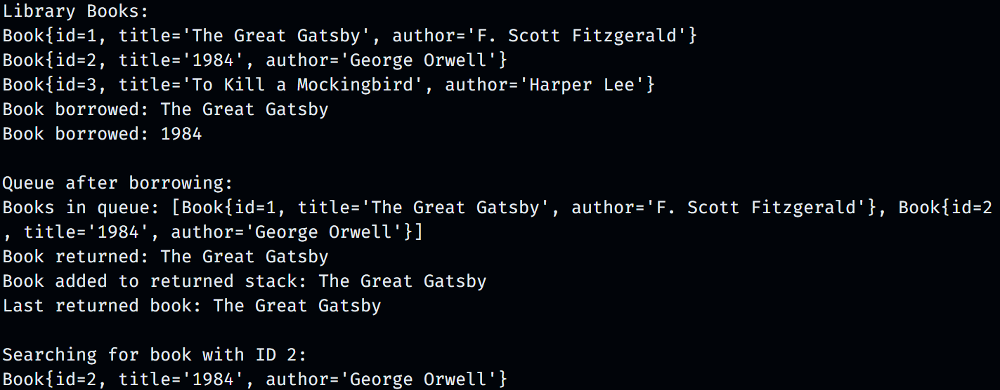

# Library Management System

The Library Management System is a Java-based application that demonstrates the implementation of various data structures and algorithms (DSA) for managing a collection of books. This project provides a simple interface for adding, borrowing, returning, and searching for books.

## Features

- **Book Management**:

  - Add books using a linked list.
  - View all books in the library.

- **Borrowing System**:

  - Implemented using a queue to manage book borrowing.
  - Supports returning borrowed books.

- **Returned Books Stack**:

  - Uses a stack to keep track of returned books and view the last returned book.

- **Searching Books**:
  - Utilizes a binary search tree (BST) to efficiently search for books by their unique ID.

# Screenshots

## Technologies Used

- **Java**: The primary programming language for the application.
- **Data Structures**:
  - Linked List for book management
  - Queue for borrowing books
  - Stack for managing returned books
  - Binary Search Tree for searching books

# Usage

The application creates a few sample books and adds them to the library.
Books can be borrowed, returned, and searched by their ID.
The console output displays the current state of the library and the operations performed.

# Example Output

---

Library Books:
Book{id=1, title='The Great Gatsby', author='F. Scott Fitzgerald'}
Book{id=2, title='1984', author='George Orwell'}
Book{id=3, title='To Kill a Mockingbird', author='Harper Lee'}
Book borrowed: The Great Gatsby
Book borrowed: 1984

Queue after borrowing:
Books in queue: [Book{id=1, title='The Great Gatsby', author='F. Scott Fitzgerald'}, Book{id=2, title='1984', author='George Orwell'}]
Book returned: The Great Gatsby
Book added to returned stack: The Great Gatsby
Last returned book: The Great Gatsby

Searching for book with ID 2:
Book{id=2, title='1984', author='George Orwell'}

---

# Acknowledgments

Developed as a learning project to explore data structures and algorithms in Java.
Thanks to the Java community for the resources that made this project possible.

# License

This project is licensed under the [MIT License](https://docs.github.com/en/repositories/managing-your-repositorys-settings-and-features/customizing-your-repository/licensing-a-repository) . See the LICENSE file for more details.

# Suvam Mohapatra
